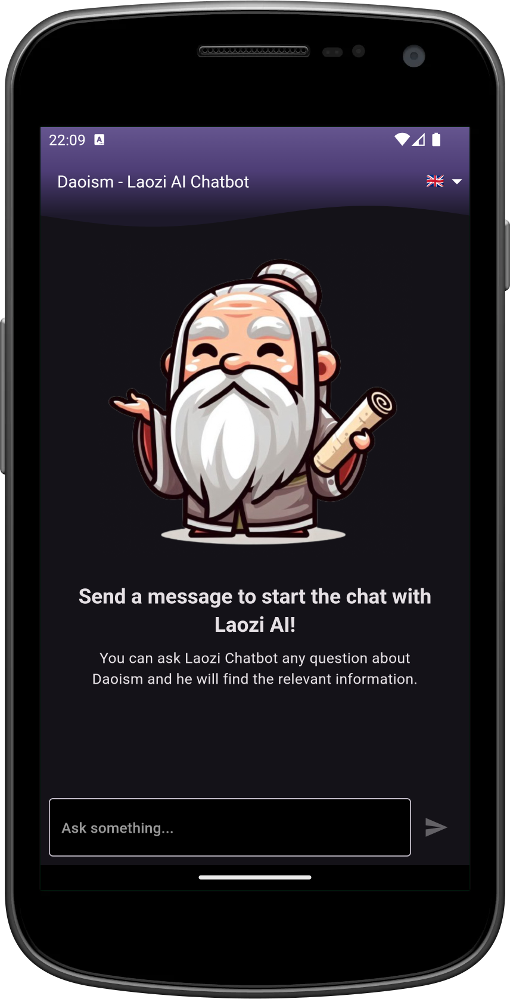

[](https://stand-with-ukraine.pp.ua)
[](https://pub.dev/packages/flutter_lints)
[](https://codecov.io/gh/Turskyi/flutter_laozi_ai)
[](https://github.com/Turskyi/flutter_laozi_ai/actions/workflows/code_quality_tests.yml)
[](https://github.com/Turskyi/flutter_laozi_ai/actions/workflows/flutter_android_ci.yml)
[](https://codemagic.io/app/667a310740730af77f00b920/667a310740730af77f00b91f/latest_build)
[](https://github.com/Turskyi/flutter_laozi_ai/actions/workflows/firebase-hosting-pull-request.yml)
[](https://github.com/Turskyi/flutter_laozi_ai/actions/workflows/firebase-hosting-merge.yml)

[](https://wakatime.com/badge/user/f9df5074-b4ea-4c17-b001-fff428ab82aa/project/a7d9d97b-45c8-4504-93b2-12eea75df734)


# Daoism • Laozi AI (Flutter Version)

This project is a Flutter-based mobile application that brings the wisdom of
Laozi and Daoist teachings to users' fingertips. It is designed with a focus on
user experience, leveraging the Flutter framework for a smooth and responsive
interface.

### Testing the App:

Join our testing program and provide valuable feedback:

- [Android App Distribution Tester Invite](https://appdistribution.firebase.dev/i/fa9deb62ac3a884b)
- [iOS TestFlight Tester Invite](https://testflight.apple.com/join/Yw8SqhUw)

## Getting Started

### Prerequisites:

- [Flutter SDK installed on your system](https://docs.flutter.dev/get-started/install).
- An [IDE with Flutter support](https://docs.flutter.dev/tools) (
  e.g., [Android Studio](https://developer.android.com/studio), [VS Code](https://code.visualstudio.com/download)).
- [Familiarity with Dart and Flutter development](https://docs.flutter.dev/get-started/codelab).

### Clone the Repository:

```bash
git clone https://github.com/Turskyi/flutter_laozi_ai
```

### Install Dependencies:

Navigate to the project directory and run:

```bash
flutter pub get
```

This will install all the necessary Flutter packages for the project.

### Environment Setup:

The app relies on environmental files that are not available in the repository and have to be added manually. Here are these files:

1. `.env` with content:

```
RESEND_API_KEY="re_abc123example"
```

This API key can be taken from [https://resend.com/api-keys](https://resend.com/api-keys).
After creating the file, run the following commands to generate `lib/env/env.g.dart`:

```bash
dart run build_runner clean
dart run build_runner build --delete-conflicting-outputs
```

2. `android/key.properties` with the following content (fill values as needed):

```properties
# dev debug environment variables
dev.SIGNING_KEY_DEBUG_PATH=../keystore/laozi_ai_debug.keystore
dev.SIGNING_KEY_DEBUG_PASSWORD=
dev.SIGNING_KEY_DEBUG_KEY=laozi_ai_debug
dev.SIGNING_KEY_DEBUG_KEY_PASSWORD=
# production release environment variables
production.SIGNING_KEY_RELEASE_PATH=../keystore/laozi_ai_release.keystore
production.SIGNING_KEY_RELEASE_PASSWORD=
production.SIGNING_KEY_RELEASE_KEY=laozi_ai_release
production.SIGNING_KEY_RELEASE_KEY_PASSWORD=

FIREBASE_ANDROID_APP_ID=

FIREBASE_TOKEN=
```

3. `android/keystore/laozi_ai_debug.keystore` (create or obtain the debug keystore).
4. `android/keystore/laozi_ai_release.keystore` (create or obtain the release keystore).
5. `android/app/google-services.json` (Firebase Android configuration file).

## Running the App:

To run the app in debug mode, execute:

```bash
flutter run
```

## Building the App:

```bash
flutter build apk --release
```

## Associated Links / Project URLs

This Flutter project interacts with and is related to the following online
resources:

1. **Primary Web Application & API Backend:**

- **URL:** [https://daoizm.online](https://daoizm.online)
- **Description:** This is the main web presence for the Laozi AI project. It
  hosts a Next.js frontend and, importantly, the **API backend that this Flutter
  application consumes** for its core functionality. While the frontend at this
  URL is built with Next.js (not Flutter), the backend services are essential
  for this mobile app.
- _Note: This domain is privately hosted and its availability depends on
  continued domain registration._

2. **Stable Web Application & API Backend (Fallback/Alternative):**

- **URL:** [https://laozi-chatbot.vercel.app](https://laozi-chatbot.vercel.app)
- **Description:** This URL also hosts the Next.js frontend and the same API
  backend used by the Flutter application. It serves as a more stable, long-term
  accessible alternative to `daoizm.online` as it's hosted on Vercel's free
  tier.

3. **Flutter Web Deployment:**

- **URL:** [https://laozi-ai.web.app](https://laozi-ai.web.app)
- **Description:** This is a **web deployment of this exact Flutter application
  **, hosted on Firebase. While the primary focus of this repository is the
  Android and iOS mobile application, this web version allows users to quickly
  try out the "mobile" experience directly in their browser without needing to
  install the app from an app store. It's provided for convenience and
  demonstration purposes.

4. **Project Board:**
   [GitHub Project Board](https://github.com/users/Turskyi/projects/17)

5. [Web and Backend Source Code (Next.js)](https://github.com/Turskyi/nextjs-laozi-chatbot)

## Libraries Used:

- [BLoC](https://pub.dev/packages/flutter_bloc) for state management.
- [Injectable](https://pub.dev/packages/injectable) for dependency injection.
- [Flutter Translate](https://pub.dev/packages/flutter_translate) for
  localization.
- [feedback](https://pub.dev/packages/feedback) for in-app user feedback.
- [Retrofit For Dart](https://pub.dev/packages/retrofit) for networking.
- [Shared preferences plugin](https://pub.dev/packages/shared_preferences) for
  local storage.
- [flutter_lints](https://pub.dev/packages/flutter_lints) for linting rules.

## Architecture:

The app follows a **monolithic onion architecture** pattern within the `lib`
folder:

- `application_services`: Contains `blocs` and repository implementations.
- `di`: Dependency injection setup.
- `domain_services`: Repository interfaces.
- `entities`: Base objects and enums used across the app.
- `infrastructure`: Web services, including models for remote calls and REST
  client implementation.
- `res`: Enums and constants.
- `router`: App routing setup with `AppRoute` enum and route implementations.
- `ui`: All the widgets used in the app.
- `main.dart` and `laozi_ai_app.dart`: Entry points of the app.

<details style="border: 1px solid #aaa; border-radius: 4px; padding: 0.5em 0.5em 0;">
  <summary style="font-weight: bold; margin: -0.5em -0.5em 0; padding: 0.5em; border-bottom: 1px solid #aaa;">Architectural pattern:

[Monolithic Onion Architecture](https://jeffreypalermo.com/2008/07/the-onion-architecture-part-1/)

  </summary>
<a href="https://sites.libsyn.com/412964/onion-architecture-episode-2">
<!--suppress CheckImageSize -->

</a>

## Layers

#### APPLICATION CORE - `entities`, `domain_services` and

`application_services` (`core`)

The number of layers in the application `core` will vary, but remember that
the `Entities` is the very center, and since all couplings are toward the
center, the `Entities` is only coupled to itself.

#### Entities - `entities`

In the very center, we see the `Entities`, which represents the state and
behavior combination that models truth for the organization.
Around the Entities are other layers with more behavior.

#### DOMAIN SERVICES - `domain_services`

The first layer around the Entities is typically where we would find
interfaces that provide object saving and retrieving behaviour, called
`repository` interfaces. The implementation of the object-saving behavior is
not in the application core, however, because it typically involves a database.
Only the interface is in the application core.

#### APPLICATION SERVICES - `application_services`

`application_services` is the layer outside `domain_services`.
`Application Services` crosses the boundaries of the layers to communicate with
`Domain Services`, however, the **Dependency Rule** is never violated.
Using **polymorphism**, `Application Services` communicates with
`Domain Services` using inherited classes: classes that implement
or extend the `repository` presented in the `Domain Services` layer.
Since `polymorphism` is used, the `repository` passed to `Application Services`
still adhere to the **Dependency Rule** since as far as `Application Services`
is concerned, they are abstract. The implementation is hidden behind the
`polymorphism`.

#### UI, INFRASTRUCTURE, TESTS – `ui`, `infrastructure`, `android`, `ios` etc.

The outer layer is reserved for things that change often.
These things should be intentionally isolated from the application `core`.

</details>

**Code Readability:** code is easily readable with no unnecessary blank lines,
no unused variables or methods, and no commented-out code, all variables,
methods, and resource IDs are descriptively named such that another developer
reading the code can easily understand their function.

## Contributing:

Contributions are welcome! If you want to contribute to this project, you can
follow these steps:

- Fork this repository and clone it to your local machine.
- Create a new branch for your feature or bug-fix.
- Make your changes and commit them with a clear and descriptive message.
- Push your branch to your forked repository and create a pull request to the
  `master` brunch.
- Wait for your pull request to be reviewed and merged.

Please follow
[the Flutter style guide](https://github.com/flutter/flutter/blob/master/docs/contributing/Style-guide-for-Flutter-repo.md)
when contributing to this project. You can also use the issues and discussions
tabs to report bugs, request features, or give feedback.

<details style="border: 1px solid #aaa; border-radius: 4px; padding: 0.5em 0.5em 0;">
  <summary style="font-weight: bold; margin: -0.5em -0.5em 0; padding: 0.5em; border-bottom: 1px solid #aaa;">Style guides:

[Style guide for Flutter](https://github.com/flutter/flutter/wiki/Style-guide-for-Flutter-repo),
[Dart style guide](https://dart.dev/effective-dart).

  </summary>

- [DO use trailing commas for all function calls and declarations unless the function call or definition, from the start of the function name up to the closing parenthesis, fits in a single line.](https://dart-lang.github.io/linter/lints/require_trailing_commas.html)

- [DON'T cast a nullable value to a non-nullable type. This hides a null check and most of the time it is not what is expected.](https://dart-lang.github.io/linter/lints/avoid_as.html)

- [PREFER using
  `const` for instantiating constant constructors](https://dart-lang.github.io/linter/lints/prefer_const_constructors.html)

If a constructor can be invoked as const to produce a canonicalized instance,
it's preferable to do so.

- [DO sort constructor declarations before other members](https://dart-lang.github.io/linter/lints/sort_constructors_first.html)

- ### Avoid Mental Mapping

A single-letter name is a poor choice; it’s just a placeholder that the reader
must mentally map to the actual concept. There can be no worse reason for using
the name `c` than because `a` and `b` were already taken.

- ### Method names

Methods should have verb or verb phrase names like `postPayment`, `deletePage`,
or `save`. Accessors, mutators, and predicates should be named for their value
and prefixed with `get`…, `set`…, and `is`….

- ### Use Intention-Revealing Names

If a name requires a comment, then the name does not reveal its intent.

- ### Use Pronounceable Names

If you can’t pronounce it, you can’t discuss it without sounding like an idiot.

- ### Class Names

Classes and objects should have noun or noun phrase names and not include
indistinct noise words:

```
GOOD:
Customer, WikiPage, Account, AddressParser.

BAD:
Manager, Processor, Data, Info.
```

- ### Functions should be small

Functions should hardly ever be 20 lines long.
Blocks within if statements, else statements, while statements, and so on
should be **_one_** line long. Probably that line should be a function call.

- ### Functions should do one thing

To know that a function is doing more than “one thing” is if you can extract
another function from it with a name that is not merely a restatement of its
implementation.

- ### One Level of Abstraction per Function

We want the code to read like a top-down narrative. We want every function to
be followed by those at the next level of abstraction so that we can read the
program, descending one level of abstraction at a time as we read down the list
of functions.

- ### Dependent Functions

If one function calls another, they should be vertically close, and the caller
should be **_above_** the callee, if possible.

- ### Use Descriptive Names

Don’t be afraid to make a name long. A long descriptive name is better than a
short enigmatic name. A long descriptive name is better than a long descriptive
comment.

- ### Function Arguments

The ideal number of arguments for a function is zero (niladic). Next comes one
(monadic), followed closely by two (dyadic). Three arguments (triadic) should
be avoided where possible.

```
GOOD:
includeSetupPage()

BAD:
includeSetupPageInto(newPageContent)
```

- ### Flag Arguments

Flag arguments are ugly. Passing a boolean into a function is a truly terrible
practice. It immediately complicates the signature of the method, loudly
proclaiming that this function does more than one thing. It does one thing if
the flag is true and another if the flag is false!

```
GOOD:
renderForSuite()
renderForSingleTest()

BAD:
render(bool isSuite)
```

- ### Explain Yourself in Code

Only the code can truly tell you what it does. Comments are, at best, a
necessary evil. Rather than spend your time writing the comments that explain
the mess you’ve made, spend it cleaning that mess. Inaccurate comments are far
worse than no comments at all.

```
BAD:
// Check to see if the employee is eligible
// for full benefits
if ((employee.flags & hourlyFlag) && (employee.age > 65))

GOOD:
if (employee.isEligibleForFullBenefits())

```

- ### TODO Comments

Nowadays, good IDEs provide special gestures and features to locate all the
`//TODO` comments, so it’s not likely that they will get lost.

- ### Public APIs

There is nothing quite so helpful and satisfying as a well-described public API.
It would be challenging, at best, to write programs without them.

```dart
/// dart doc comment
```

- ### Commented-Out Code

We’ve had good source code control systems for a very long time now. Those
systems will remember the code for us. We don’t have to comment it out anymore.

- ### Position Markers

In general, they are the clutter that should be eliminated—especially the noisy
train of slashes at the end. If you overuse banners, they’ll fall into the
background noise and be ignored.

```dart
// Actions //////////////////////////////////
```

- ### Don’t Return Null

When we return `null`, we are essentially creating work for ourselves and
foisting problems upon our callers. All it takes is one missing `null` check to
send an app spinning out of control.

- ### Don’t Pass Null

In most programming languages, there is no **GOOD** way to deal with a `null`
that is passed by a caller accidentally. Because this is the case, the rational
approach is to forbid passing null by default. When you do, you can code with
the knowledge that a `null` in an argument list is an indication of a problem,
and end up with far fewer careless mistakes.

- ### Classes Should Be Small!

With functions, we measured size by counting physical lines. With classes, we
use a different measure. **We count responsibilities.** The Single
Responsibility Principle (SRP) states that a class or module should have one,
and only one, reason to change. The name of a class should describe what
responsibilities it fulfills. The more ambiguous the class name, the more
likely it has too many responsibilities. The problem is that too many of us
think that we are done once the program works. We move on to the next problem
rather than going back and breaking the overstuffed classes into decoupled
units with single responsibilities.

- ### Artificial Coupling

In general, an artificial coupling is a coupling between two modules that
serves no direct purpose. It is a result of putting a variable, constant, or
function in a temporarily convenient, though inappropriate, location. For
example, general `enum`s should not be contained within more specific classes
because this forces the app to know about these more specific classes. The same
goes for general purpose `static` functions being declared in specific classes.

- ### Prefer Polymorphism to If/Else or Switch/Case

There may be no more than one switch statement for a given type of selection.
The cases in that switch statement must create polymorphic objects that take
the place of other such switch statements in the rest of the system.

- ### Replace Magic Numbers with Named Constants

In general, it is a bad idea to have raw numbers in your code. You should hide
them behind well-named constants. The term “Magic Number” does not apply only
to numbers. It applies to any token that has a value that is not
self-describing.

- ## Encapsulate Conditionals

Boolean logic is hard enough to understand without having to see it in the
context of an `if` or `while` statement. Extract functions that explain the
intent of the conditional.

```
GOOD:
if (shouldBeDeleted(timer))

BAD:
if (timer.hasExpired() && !timer.isRecurrent())
```

- ### Avoid Negative Conditionals

Negatives are just a bit harder to understand than positives. So, when
possible, conditionals should be expressed as positives.

```
GOOD:
if (buffer.shouldCompact())

BAD:
if (!buffer.shouldNotCompact())
```

- ### Encapsulate Boundary Conditions

Boundary conditions are hard to keep track of. Put the processing for them in
one place.

```
BAD:
if (level + 1 < tags.length) {
  parts = Parse(body, tags, level + 1, offset + endTag);
  body = null;
}

GOOD:
int nextLevel = level + 1;
if (nextLevel < tags.length) {
  parts = Parse(body, tags, nextLevel, offset + endTag);
  body = null;
}
```

- ### Constants versus Enums

Don’t keep using the old trick of public `static` `final` `int`s. `enum`s can
have methods and fields. This makes them very powerful tools that allow much
more expression and flexibility.

</details>

## Contact:

For any inquiries or suggestions, please open an issue on the GitHub repository
or reach out to me directly at
[support@daoizm.online](mailto:support@daoizm.online).

## Screenshots:

<!--suppress CheckImageSize -->

<!--suppress CheckImageSize -->

<!--suppress CheckImageSize -->


## Screen Recording:


## Download

<!--suppress HtmlDeprecatedAttribute -->
<p align="center">
  <a href="https://play.google.com/store/apps/details?id=com.turskyi.laozi_ai" target="_blank">
    
  </a>
  <a href="https://apps.apple.com/ca/app/daoism-laozi-ai/id6743682937" target="_blank">
    
  </a>
</p>

## [[Video] Daoism • Laozi AI: App Demo & Development with Google Gemini](https://www.youtube.com/watch?v=wyVk3TPaE7c)

[](https://www.youtube.com/watch?v=wyVk3TPaE7c)

**Developer:** Dmytro Turskyi ([turskyi.com](https://turskyi.com))  
_Single developer and maintainer of this project._
